# Notas SIGAA

> Um script python para automatizar planilhas com dados do usuário crawleados da plataforma SIGAA - UNIFEI

## Índice

- [Disclaimer](#disclaimer)
- [Sobre](#sobre)
- [Tecnologias usadas](#tecnologias-usadas)
- [Como rodar o projeto](#como-rodar-o-projeto)
  - [Setup](#setup)
  - [Requirements](#requirements)
  - [Checklist e finalmente rodar o script](#checklist-e-finalmente-rodar-o-script)
- [Como colaborar](#como-colaborar)
- [Licença](#licença)

## Disclaimer

Este projeto foi desenvolvido com finalidade única e exclusivamente acadêmica. Caso não esteja de acordo com exposição e/ou utilização deste trabalho, mande um e-mail para joelvitortorres@mail.com e este repositório será ocultado imediatamente

## Sobre

Criei este projeto com o intuito de, primeiramente, aprender sobre Web Scraping e Data Manipulation com Python e, segundamente, automatizar a organização das minhas notas em planilhas predefinidas.

## Tecnologias usadas

- Python 3.8
- Selenium
- Beautiful Soup
- Pandas
- Google Drive API

## Como rodar o projeto

> Para rodar o projeto é necessário um ambiente com Python 3.8 instalado (o script não foi testado em outras versões)

Primeiramente é preciso baixar o projeto como um zip ou por meio do comando `git clone "https://github.com/joevtap/NotasSIGAA.git"`

### Setup

1. Crie um projeto na Google Cloud Platform [clicando aqui](https://console.cloud.google.com/cloud-resource-manager)

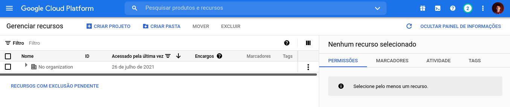

2. Nomeie seu projeto

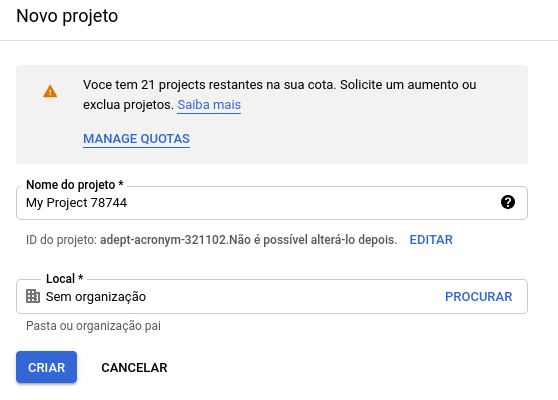

3. Acesse [este link](https://console.cloud.google.com/apis/library/) e busque por `Drive`

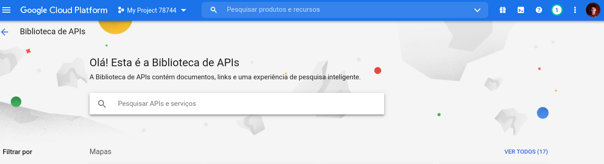

4. Clique em `ativar`

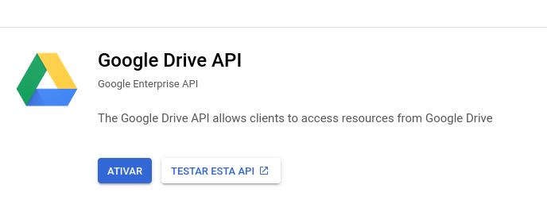

5. Clique em `credenciais`

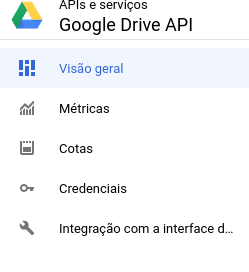

6. Depois em `gerenciar contas de serviço`

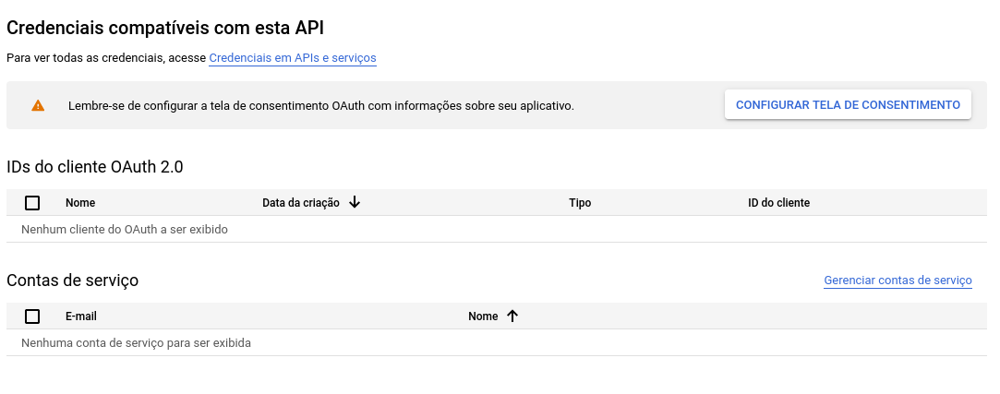

7. Clique em `criar conta de serviço`

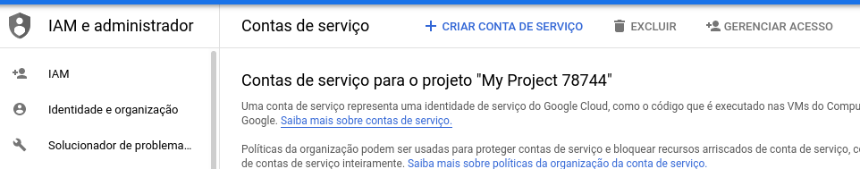

8. Preencha os campos obrigatórios e crie a conta de serviço

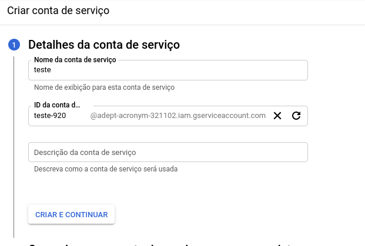

9. Clique no email da conta de serviço criada
10. Vá para aba `chaves` e clique em `adicionar chave`

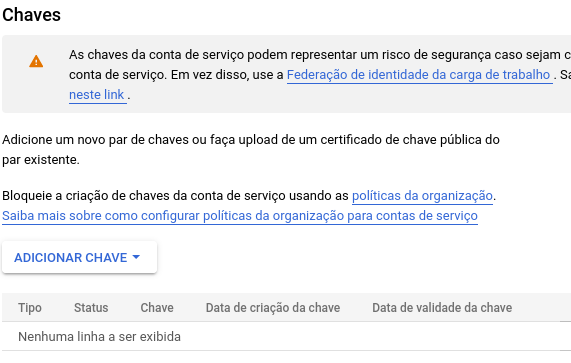

11. Selecione a opção `JSON`, salve o arquivo e o renomeie da forma como preferir (recomendado: `credentials.json`)

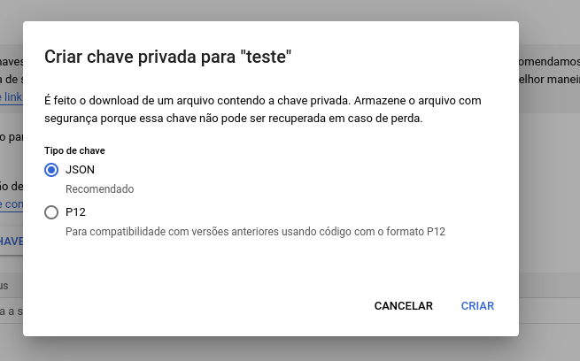

12. Crie uma nova planilha no [Google Sheets](https://sheets.google.com) e a nomeie da forma como preferir (guarde esse nome)

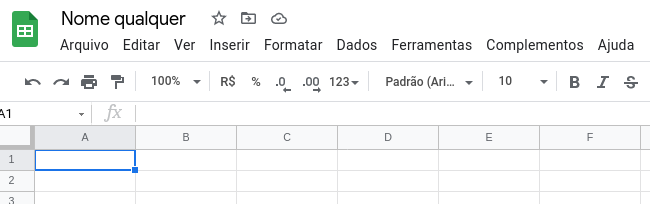

13. Compartilhe a planilha com a conta de serviço, por meio do e-mail gerado (inclua a permissão de editor)

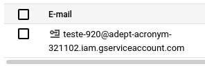

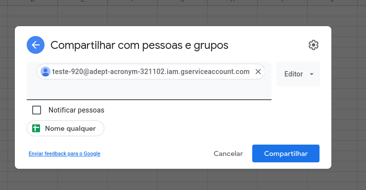

14. Tudo feito!

### Requirements

1. É aconselhável, mas não obrigatório, criar um virtual enviroment para o projeto, veja [neste link](https://docs.python.org/3.8/library/venv.html) mais detalhes sobre esse passo
2. Instale as dependências por meio do comando `pip install -r requirements.txt` (o comando pode variar dependendo do sistema operacional/terminal/versão do pip em que for executado)
3. [Baixe a versão do `chromedriver`](https://chromedriver.chromium.org/) para a versão do navegador chrome instalado em seu ambiente
4. Certifique-se de saber a localização dos arquivos baixados
5. Rode `python setup.py` (ou variantes) para gerar suas variáveis de ambiente **(não exponha suas variáveis de ambiente)**

### Checklist e finalmente rodar o script

**Esteja certo de que concluiu os seguintes requisitos:**

- Setup Google Drive API
- Dependências
- Chrome e web driver
- Variaveis de ambiente

Rode `python main.py` (ou variantes) e veja a mágica acontecer

## Como colaborar

Você pode colaborar no desenvolvimento deste projeto por meio de:

- Notificação de issues
- Correção de bugs (faça um Pull Request)
- Sugestões de novas features (abra uma issue)
- Implementação de novas features (faça um Pull Request)

## Licença

Esse projeto está sob a [licença do MIT](LICENSE)
